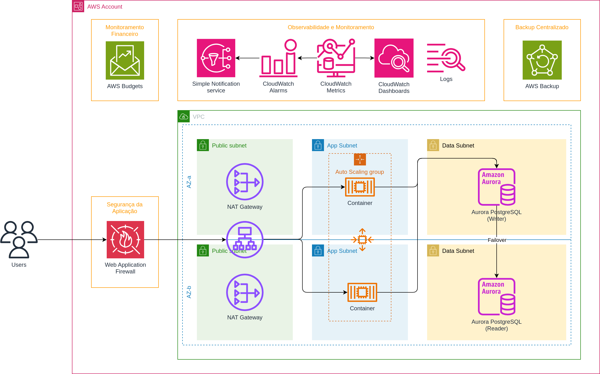
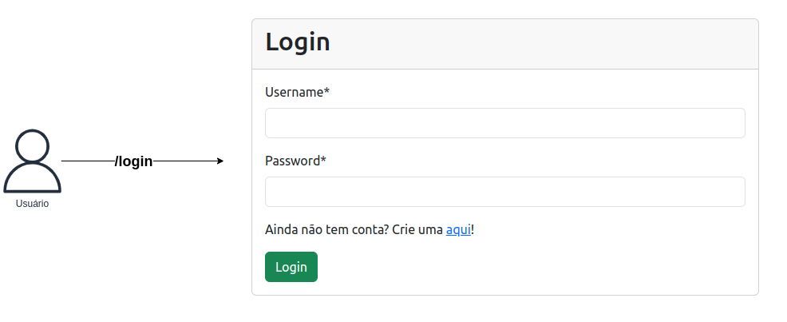
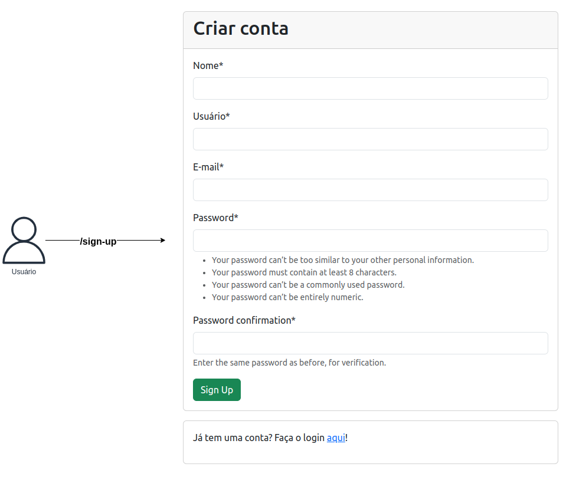

# toCloud - Software web para gerenciar pequenos projetos

Esse projeto foi desenvolvido para ser o projeto de conclusão de curso da disciplina PADRÕES DE PROJETOS ORIENTADOS A OBJETOS - 4ºB e 4ºC (Pré-aula).

# Membros do grupo:

Lucca Jimenez Bastos - 11221104663

Vinicius Mendonça - 11221102847

Maria Eduarda Rodrigues - 11221100369

Pedro Rodriguez - 11212100847

# Diagrama de arquitetura da infraestrutura

## Segurança da aplicação

Utilizamos o serviço Web Application Firewall (WAF) para analisar requisição por requisição automáticamente em busca de possíveis tentativas de invasão ou HTTP Flood (DDoS).

"Essa solução implanta automaticamente um conjunto de regras do AWS WAF (Web Application Firewall) que filtram ataques comuns baseados na Web. Os usuários podem selecionar recursos de proteção pré-configurados que definem as regras incluídas em uma lista de controle de acesso à Web (ACL da Web) do AWS WAF. Quando implantado, o AWS WAF protege as suas distribuições do Amazon CloudFront ou seus Application Load Balancers por meio da inspeção de solicitações da Web." - AWS

Solução: https://aws.amazon.com/pt/solutions/implementations/security-automations-for-aws-waf/

## Workload

Na camada pública (Public Subnet) utilizamos o serviço **Application Load Balancer** para fazer o proxy reverso, SSL/HTTPs e balanceamento de carga entre o serviço. O serviço também tem integração direta com o **WAF**.

Na camada de aplicação (App Subnet) estamos utilizando o orquestrador **Elastic Container Service (ECS)** que gerencia os containers, que estão privados e só podem ser acessados exclusivamente pelo Load Balancer. Também nessa camada, estamos utilizando um **Auto Scaling** que com base nas métricas de CPU, verifica continuamente se é necessário aumentar ou diminuir a quantidade de containers, para aguentar a carga. O Load Balancer balanceia a carga entre os containers.

Na camada de dados (Data Subnet) está localizado um banco de dados **Aurora PostgreSQL** que gerencia a manutenção do banco automáticamente. Temos duas replicas, uma que é a primária (escrita) e outra para leitura, que também serve de failover. Se algo acontecer, ela está pronta para se tornar uma instância primária de escrita.

## Rede

A VPC é composta por três camadas: Camada Pública, Camada de Aplicação e Camada de Dados.

A camada pública é exclusiva para balanceadores de carga, VPNs (OpenVPN), NAT Gateways. Nela não fica nenhuma apliação ou banco de dados.

Na camada de aplicação, fica os containers e outros tipos de compute que processam algo. Nela, a internet é acessivel por NAT Gateways gerenciados, que não permitem a entrada de trafego, apenas a saída. Logo, os containers conseguem acessar a internet sem o risco de serem acessados públicamente.

A camada de dados é exclusiva para banco de dados, como: PostgreSQL, ElastiCache, etc. Nela não existe nenhum acesso à internet. Essa camada é totalmente restrita e só é acessivel por VPN ou aplicações.

## Observabilidade e Monitoramento

Nessa solução estamos usando a familia de serviços do CloudWatch para monitorar as métricas e logs das aplicações, como: Utilização de CPU, Memória. Também, recebemos alarmes com o CloudWatch Alarms se algo sair fora do esperado.

Para monitoramento de custos, estamos utilizando o AWS Budgets para ter uma estimativa de custos (Forecast) e ser avisados antes de algo gaste demais.

## Backup dos bancos de dados

Utilizamos o AWS Backup para gerenciar centralmente os backups feitos e também, colocar proteção nesses backups.

# Fluxo de login e cadastro do usuário

### Login

### Criar conta

